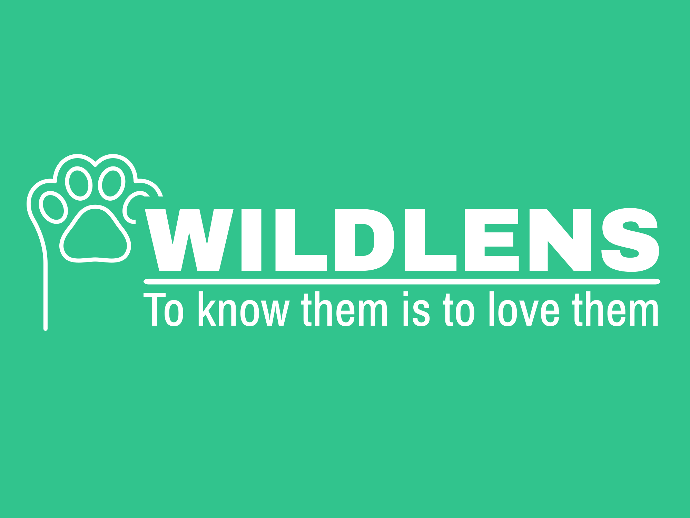

# WildALens - Identification d'empreintes animales



## Description

WildLens est une application web mobile permettant d'identifier automatiquement des empreintes d'animaux à partir de photos prises sur le terrain. Grâce à l'intelligence artificielle, l'application analyse les images d'empreintes et fournit des informations éducatives sur l'espèce animale identifiée.


## Fonctionnalités principales

- 📸 **Capture d'empreintes** : Prenez une photo ou importez une image
- 🐾 **Reconnaissance d'empreintes** : Identification de 13 espèces différentes
- 📊 **Affichage détaillé** : Informations sur l'animal et niveau de confiance
- 📱 **Interface adaptative** : Adapté aux appareils mobiles et ordinateurs
- 🔐 **Authentification sécurisée** : Gestion des comptes utilisateurs
- 🌐 **Stockage cloud** : Sauvegarde des données dans Supabase

## Démarrage rapide

### Installation avec Docker (recommandé)

```bash
# Cloner le dépôt
git clone https://github.com/7Nayy/MSPR-6.1.git
cd wildlens

# Configurer les variables d'environnement
cp .env.example .env
# Éditer le fichier .env avec vos informations

# Démarrer l'application
docker-compose up -d
```

L'application sera accessible à l'adresse : http://localhost:5000

### Mode développement

```bash
# Utiliser la configuration de développement
docker-compose -f docker-compose.dev.yml up -d
```

L'application en mode développement sera accessible à l'adresse : http://localhost:5001


## Technologies utilisées

- **Backend** : Python 3.10, Flask
- **Frontend** : HTML5, CSS3, JavaScript
- **Base de données** : Supabase (PostgreSQL)
- **IA** : PyTorch, OpenCV
- **Authentification** : Supabase Auth
- **Conteneurisation** : Docker
- **CI/CD** : GitHub Actions

## Structure du projet

```
wildlens/
├── python_file/         # Code backend Flask et IA
├── static/              # Ressources statiques (CSS, JS)
├── templates/           # Modèles HTML
├── .github/             # Configuration GitHub Actions
├── Dockerfile           # Configuration Docker pour production
├── docker-compose.yml   # Configuration Docker Compose
└── requirements.txt     # Dépendances Python
```

## Espèces reconnues

L'application peut identifier les empreintes des espèces suivantes :
- Renard
- Loup
- Raton laveur
- Lynx
- Ours
- Castor
- Chat
- Chien
- Coyote
- Ecureuil
- Lapin
- Puma
- Rat

## Déploiement en production

Pour déployer l'application en production :

1. Configurer les variables d'environnement pour la production
2. Utiliser le workflow CI/CD ou déployer manuellement :
   ```bash
   docker-compose -f docker-compose.prod.yml up -d
   ```
3. Configurer un serveur web (comme Nginx) comme proxy inverse
4. Mettre en place HTTPS avec Let's Encrypt

## Documentation

- [Documentation complète](docs/DOCUMENTATION.md)
- [Guide développeur](docs/GUIDE-DEV.md)
- [Guide de versioning](docs/VERSIONING.md)

## Contribution

Les contributions sont les bienvenues ! Veuillez consulter notre [guide de contribution](docs/CONTRIBUTING.md) avant de soumettre une pull request.

## Prérequis

- Docker et Docker Compose
- Compte Supabase
- Navigateur web moderne

## Licence

Ce projet est sous licence MIT. Voir le fichier [LICENSE](LICENSE) pour plus de détails.

## Auteurs

- Équipe EPSI - MSPR 6.1
